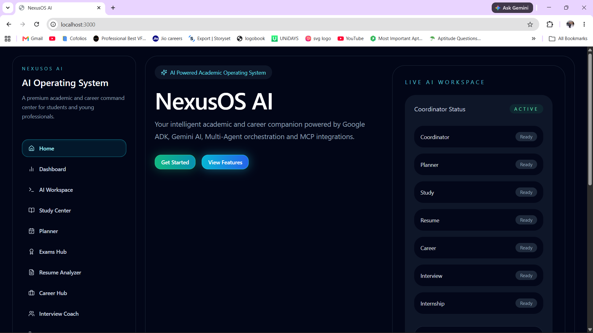
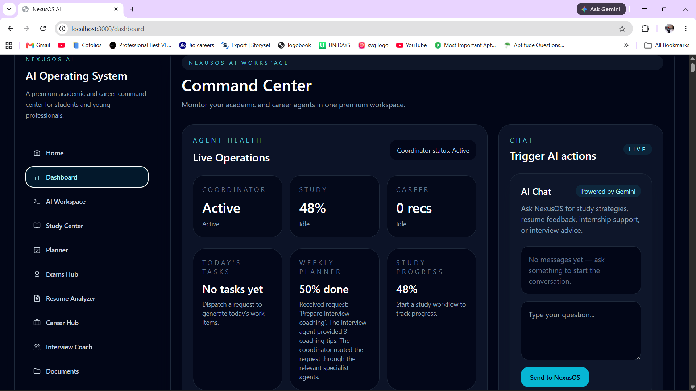
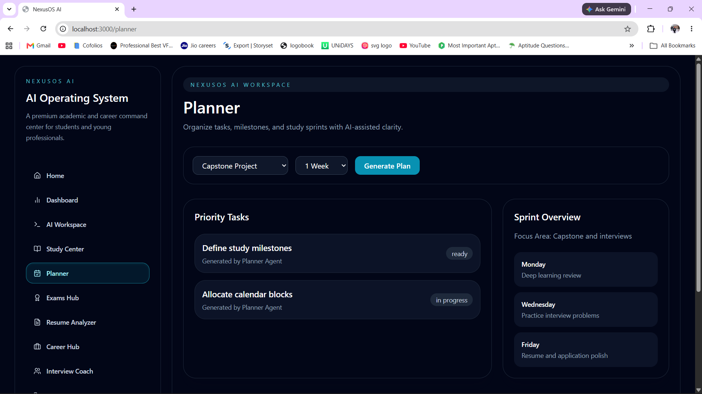
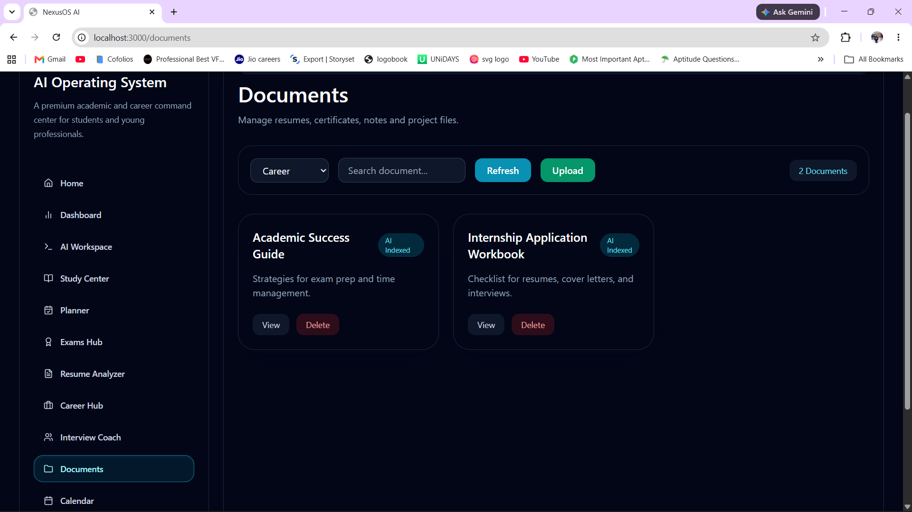

# 🚀 NexusOS AI

<div align="center">

### AI-Powered Academic & Career Operating System

**Built with Google Agent Development Kit (ADK), Model Context Protocol (MCP), FastAPI, React, and Python**


</div>

---

## 📖 Overview

Students often rely on multiple disconnected tools for learning, planning, resumes, interviews, internships, and career preparation.

**NexusOS AI** brings these workflows into a single intelligent platform powered by **Google ADK** and a **multi-agent architecture**. Instead of interacting with a single chatbot, users collaborate with specialized AI agents coordinated by a central orchestrator that intelligently routes each request.
---

# 📸 Application Showcase

## 🏠 Landing Page

<p align="center">
  
</p>

The landing page introduces NexusOS AI and provides access to the complete Academic & Career Operating System.

---

## 📊 Dashboard

<p align="center">
  
</p>

The dashboard provides an overview of productivity metrics, AI insights, upcoming activities, and personalized recommendations.

---

## 🤖 AI Workspace

<p align="center">
  
</p>

Interact with the AI Coordinator Agent to access all specialist agents from one unified interface.

---

## 📚 Study Centre

<p align="center">
  
</p>

Generate personalized study plans, revision schedules, and learning strategies.

---

## 📅 Planner

<p align="center">
  
</p>

Create weekly study plans and manage daily academic tasks efficiently.

---

## 📄 Resume Analyzer

<p align="center">
  
</p>

Receive AI-powered resume reviews with actionable improvement suggestions.

---

## 💼 Career Hub

<p align="center">
  
</p>

Discover career roadmaps, required skills, and personalized guidance.

---

## 🎤 Interview Coach

<p align="center">
  
</p>

Practice technical and HR interview questions with instant AI feedback.

---

## 📅 Calendar

<p align="center">
  
</p>

Manage schedules, deadlines, and important academic events.

---

## 📂 Document Manager

<p align="center">
  
</p>

Organize and access academic documents using integrated AI assistance.

---

## 📝 Exam Hub

<p align="center">
  
</p>

Track examinations, revision progress, and upcoming assessments.

---
---

## ✨ Key Features

- 🤖 Google ADK-powered Multi-Agent System
- 🧠 Intelligent Coordinator Agent
- 📚 AI Study Planning
- 📅 Weekly Planner
- 📄 Resume Analysis
- 💼 Career Guidance
- 🎤 Interview Preparation
- 🎯 Internship Assistance
- ⏰ Life Scheduler
- 🔌 MCP Tool Integration
- 📂 Document Search
- 📅 Calendar Management
- 📊 Analytics Dashboard
- ⚡ FastAPI Backend
- 🎨 React + TypeScript Frontend
- 💾 SQLite Persistence
- 🐳 Docker Support

---

# 🏗 System Architecture

```
                 React Frontend
                        │
                        ▼
                FastAPI Backend
                        │
                        ▼
         Google ADK Coordinator Agent
                        │
      ┌────────┬────────┬────────┐
      ▼        ▼        ▼        ▼
 Planner  Resume  Career  Study
      │        │        │
      └────────┴────────┘
               │
               ▼
        MCP Tool Registry
               │
 ┌────────┬────────┬────────┬────────┐
 ▼        ▼        ▼        ▼
Calendar Documents Search GitHub
               │
               ▼
         SQLite Database
```

---

# 🤖 Multi-Agent Architecture

Every user request is first handled by the **Coordinator Agent**, built using **Google Agent Development Kit (ADK)**.

The coordinator analyzes user intent and dynamically routes the request to one or more specialist agents.

### Specialist Agents

| Agent | Responsibility |
|---------|----------------|
| 📅 Planner Agent | Weekly Planning |
| 📚 Study Agent | Exam Preparation |
| 📄 Resume Agent | Resume Review |
| 💼 Career Agent | Career Guidance |
| 🎤 Interview Agent | Interview Coaching |
| 🎯 Internship Agent | Internship Search |
| ⏰ Life Scheduler | Time Management |

---

# 🔌 MCP Integration

NexusOS AI integrates the **Model Context Protocol (MCP)** to securely communicate with external tools.

Current MCP services include:

- 📅 Calendar
- 📂 Documents
- 🔍 Search
- 💻 GitHub

Rather than allowing agents to directly communicate with services, every interaction passes through a centralized **MCP Tool Registry**, making the system modular and extensible.

---

# 🔒 Security

The project includes multiple security mechanisms:

- Prompt Validation
- Input Sanitization
- Safe MCP Tool Execution
- Error Handling
- Environment Variable Support
- Secure Agent Routing

---

# 🛠 Tech Stack

### Backend

- Python
- FastAPI
- Google ADK
- SQLite

### Frontend

- React
- TypeScript
- Tailwind CSS
- Vite

### AI

- Google Gemini
- Google ADK
- MCP

### DevOps

- Docker
- Docker Compose

---

# 🚀 Getting Started

## Clone Repository

```bash
git clone https://github.com/YOUR_USERNAME/NexusOS-AI.git
cd NexusOS-AI
```

## Configure Environment

```bash
cp .env.example .env
```

Add your Google Gemini API Key.

```
GOOGLE_API_KEY=YOUR_KEY
```

## Install Dependencies

Backend

```bash
pip install -r backend/requirements.txt
```

Frontend

```bash
cd frontend
npm install
```

---

## Run Backend

```bash
python -m uvicorn app.main:app --reload --host 127.0.0.1 --port 8000 --app-dir backend
```

## Run Frontend

```bash
npm run dev
```

---

## Docker

```bash
docker compose up --build
```

---

# 📂 Project Structure

```
backend/
    app/
        agents/
        api/
        mcp/
        skills/
        services/
        db/

frontend/
    src/
        pages/
        components/
        services/
```

---

# 🎯 Future Roadmap

- Voice Assistant
- Mobile App
- LMS Integration
- Multi-modal Learning
- Cloud Deployment
- Team Collaboration
- Additional MCP Tools

---

# 👨‍💻 Author

**Kulmeet Singh Chauhan**

Built for the **Kaggle AI Agents: Intensive Vibe Coding Capstone Project (2026)**

---

# 📜 License

This project is licensed under the MIT License.
