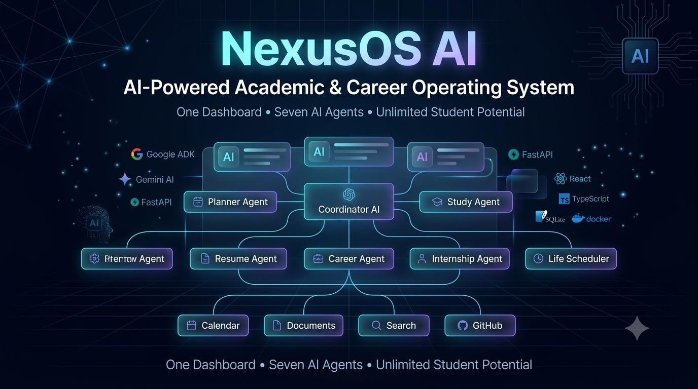

<p align="center">
  
</p>

<h1 align="center">🚀 NexusOS AI</h1>

<h3 align="center">
AI-Powered Academic & Career Operating System
</h3>

<p align="center">
Built using <b>Google Agent Development Kit (ADK)</b>, <b>Model Context Protocol (MCP)</b>, <b>FastAPI</b>, <b>React</b>, and <b>Python</b>.
</p>

<p align="center">


</p>

---

# 📖 Overview

Students today constantly switch between multiple disconnected platforms to manage learning, internships, resumes, interviews, schedules, and career preparation.

**NexusOS AI** combines all of these workflows into a single intelligent operating system powered by Google's **Agent Development Kit (ADK)** and **Model Context Protocol (MCP)**.

Instead of relying on a single chatbot, NexusOS AI orchestrates multiple specialized AI agents capable of collaborating together to solve complex academic and career-related tasks.

---

# 🌟 Why NexusOS AI?

Unlike traditional AI assistants, NexusOS AI provides:

- 🤖 Multi-Agent Collaboration
- 🎯 Intelligent Task Routing
- 📚 Academic Planning
- 💼 Career Guidance
- 📄 Resume Analysis
- 🎤 Interview Preparation
- 📅 Scheduling
- 📂 Document Management
- 🔌 MCP Tool Integration
- 📊 Analytics Dashboard

---

# 📸 Application Showcase

(Add all your screenshots here)

Landing

Dashboard

Workspace

Study Centre

Planner

Resume Analyzer

Career Hub

Interview Coach

Calendar

Documents

Exam Hub

---

# 🤖 Google ADK Multi-Agent Architecture

<p align="center">

</p>

NexusOS AI is built using **Google Agent Development Kit (ADK)**.

Every user request first reaches the **Coordinator Agent**, which performs:

- Intent Understanding
- Context Analysis
- Agent Selection
- Multi-Agent Coordination
- Response Aggregation

The Coordinator dynamically invokes one or more specialist agents.

### Specialist Agents

| Agent | Purpose |
|-------|----------|
| 📅 Planner Agent | Weekly Planner |
| 📚 Study Agent | Study Plans |
| 📄 Resume Agent | Resume Review |
| 💼 Career Agent | Career Roadmaps |
| 🎤 Interview Agent | Mock Interviews |
| 🎯 Internship Agent | Internship Search |
| ⏰ Life Scheduler | Time Management |

This modular architecture enables scalability, maintainability, and easy addition of future AI agents.

---

# 🏗 System Architecture

<p align="center">

</p>

### Architecture Flow

```
User
   │
React Frontend
   │
FastAPI Backend
   │
Google ADK Coordinator
   │
Specialist Agents
   │
MCP Registry
   │
External Services
   │
SQLite Database
```

The React frontend communicates with the FastAPI backend, which delegates requests to the Google ADK Coordinator Agent. The Coordinator orchestrates specialist agents, securely accesses external tools through MCP, and returns structured responses.

---

# 🔌 MCP Workflow

<p align="center">

</p>

NexusOS AI integrates the **Model Context Protocol (MCP)** to standardize communication with external services.

Current MCP Servers:

- 📅 Calendar Server
- 📂 Document Server
- 🔍 Search Server
- 💻 GitHub Server

Instead of allowing agents to directly access APIs, every interaction passes through the MCP Tool Registry, providing:

- Secure Tool Invocation
- Standardized Interfaces
- Modular Integrations
- Easy Future Expansion

---

# ⚙️ End-to-End Request Flow

```
User Prompt
      │
      ▼
React Dashboard
      │
      ▼
FastAPI API
      │
      ▼
Coordinator Agent (Google ADK)
      │
      ├───────────────┐
      ▼               ▼
Study Agent      Resume Agent
Career Agent     Planner Agent
Interview Agent  Internship Agent
Life Scheduler
      │
      ▼
MCP Registry
      │
      ▼
External Services
      │
      ▼
Response Aggregation
      │
      ▼
User Dashboard
```

---

# ✨ Features

- Google ADK Multi-Agent Architecture
- Coordinator Agent
- MCP Tool Registry
- Academic Planning
- Weekly Study Planner
- Resume Analysis
- Career Guidance
- Interview Coaching
- Internship Assistance
- Calendar Integration
- Document Management
- Analytics Dashboard
- Secure Agent Routing
- Docker Deployment

---

# 🛠 Tech Stack

## Backend

- Python
- FastAPI
- Google ADK
- SQLite

## Frontend

- React
- TypeScript
- Tailwind CSS
- Vite

## AI

- Google Gemini
- Google ADK
- MCP

## DevOps

- Docker
- Docker Compose

---

# 📂 Project Structure

```text
backend/
├── app/
│   ├── agents/
│   ├── api/
│   ├── core/
│   ├── db/
│   ├── mcp/
│   ├── services/
│   └── skills/

frontend/
├── src/
│   ├── components/
│   ├── pages/
│   ├── services/
│   └── stores/

images/

README.md
docker-compose.yml
```

---

# 🚀 Installation

```bash
git clone https://github.com/Bunny1089/NexusOS-AI.git

cd NexusOS-AI
```

Create environment file

```bash
cp .env.example .env
```

Add

```
GOOGLE_API_KEY=YOUR_KEY
```

Backend

```bash
pip install -r backend/requirements.txt
```

Frontend

```bash
cd frontend
npm install
```

Run

Backend

```bash
python -m uvicorn app.main:app --reload --host 127.0.0.1 --port 8000 --app-dir backend
```

Frontend

```bash
npm run dev
```

---

# 🐳 Docker

```bash
docker compose up --build
```

---

# 🔒 Security

- Prompt Validation
- Input Sanitization
- MCP Tool Validation
- Secure Agent Routing
- Environment Variables
- Exception Handling

---

# 🎯 Future Roadmap

- Voice AI Assistant
- Mobile App
- LMS Integration
- Cloud Deployment
- Multi-modal Learning
- Additional MCP Servers
- Multi-user Collaboration

---

# 👨‍💻 Author

**Kulmeet Singh Chauhan**

Built for the **Kaggle AI Agents: Intensive Vibe Coding Capstone Project (2026)**

---

# 📜 License

Licensed under the **MIT License**.