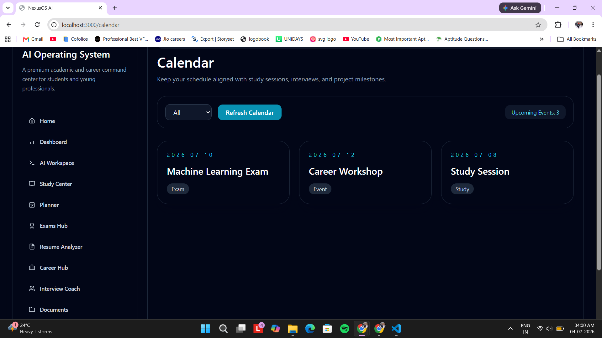

<!-- ========================================================= -->
<!--                       NEXUSOS AI                           -->
<!-- ========================================================= -->

<p align="center">


</p>

<h1 align="center">🚀 NexusOS AI</h1>

<h3 align="center">
AI-Powered Academic & Career Operating System
</h3>

<p align="center">

Built with <strong>Google Agent Development Kit (ADK)</strong>, <strong>Google Gemini</strong>, <strong>Model Context Protocol (MCP)</strong>, <strong>FastAPI</strong>, <strong>React</strong>, <strong>TypeScript</strong>, and <strong>SQLite</strong>.

</p>

<p align="center">

<b>One Dashboard • Seven AI Agents • Unlimited Student Potential</b>

</p>

---

<p align="center">


</p>

---

# 🌟 Quick Snapshot

> **NexusOS AI** is an AI-powered Academic & Career Operating System that brings planning, studying, resume analysis, interview preparation, internship discovery, document management, and intelligent scheduling into one unified platform.
>
> Instead of relying on a single chatbot, NexusOS AI leverages **Google Agent Development Kit (ADK)** to orchestrate multiple specialized AI agents that collaborate seamlessly through a centralized Coordinator Agent while securely interacting with external tools via the **Model Context Protocol (MCP)**.

---

# 📊 Project Highlights

| Metric | Value |
|---------|------:|
| 🤖 AI Agents | **7 Specialist Agents** |
| 🎯 Coordinator Agent | ✅ |
| 🔌 MCP Tool Servers | **4** |
| 📚 Study Planner | ✅ |
| 📄 Resume Analyzer | ✅ |
| 💼 Career Hub | ✅ |
| 🎤 Interview Coach | ✅ |
| 📅 Calendar System | ✅ |
| 📂 Document Manager | ✅ |
| 📊 Dashboard Modules | **10+** |
| 🌐 REST API Endpoints | **15+** |
| 💾 SQLite Persistence | ✅ |
| 🔒 Secure Routing | ✅ |
| 🐳 Docker Support | ✅ |

---

# 🎥 Live Demo

<p align="center">

<a href="https://www.youtube.com/watch?v=ok3tF8uhSPI">


</a>

</p>

<p align="center">

🎬 <b>Click the thumbnail above to watch the complete walkthrough of NexusOS AI.</b>

</p>

### Demo Includes

- 🤖 Google ADK Multi-Agent Orchestration
- 🔌 Model Context Protocol (MCP) Integration
- 📚 AI-Powered Study Planning
- 📄 Resume Analysis & ATS Scoring
- 💼 Career Recommendations
- 🎤 Interview Coaching
- 📅 Calendar Management
- 📂 Document Management
- 📊 Real-Time Dashboard Analytics
- 📈 Activity Timeline & SQLite Persistence

---

# 📖 Overview

Modern education has become increasingly digital, yet students still rely on a fragmented ecosystem of applications to manage their academic and professional lives.

A typical student switches between multiple platforms for planning coursework, organizing schedules, writing resumes, preparing for interviews, searching for internships, managing documents, and seeking AI assistance. This constant context switching reduces productivity, creates unnecessary complexity, and makes it difficult to maintain a unified learning experience.

**NexusOS AI** was designed to solve this challenge.

Rather than functioning as another standalone chatbot, NexusOS AI acts as an intelligent operating system where multiple specialized AI agents collaborate to provide personalized academic and career assistance through a single unified interface.

Powered by **Google Agent Development Kit (ADK)**, **Google Gemini**, and the **Model Context Protocol (MCP)**, the platform intelligently routes user requests to the most suitable specialist agents while maintaining context across workflows.

Whether a student needs a personalized study schedule, resume feedback, internship recommendations, interview preparation, calendar organization, or document management, NexusOS AI orchestrates the appropriate AI agents to deliver a single cohesive experience.

---

# 💡 Why We Built NexusOS AI

Today's students use a growing number of disconnected platforms throughout their academic journey.

A typical workflow often involves switching between:

- 📅 Google Calendar
- 🤖 AI Chatbots
- 📄 Resume Builders
- 💼 LinkedIn
- 💻 GitHub
- 🎤 Interview Platforms
- 📚 Study Planning Tools
- 📝 Note Taking Applications
- 📂 Document Storage Services

Each tool solves only one part of the student's journey.

As a result, students constantly lose context, duplicate work across applications, and spend more time managing tools than focusing on learning.

NexusOS AI was built to eliminate this fragmentation by creating a single intelligent operating system where specialized AI agents work together to support students throughout their complete academic and career journey.

Instead of replacing existing tools, NexusOS AI intelligently coordinates them through **Google ADK** and **MCP**, providing a seamless, modular, and extensible AI experience.

---

# ⚖️ Traditional Student Workflow vs NexusOS AI

| Traditional Workflow | NexusOS AI |
|----------------------|------------|
| Multiple disconnected applications | One unified AI platform |
| Generic chatbot conversations | Specialized AI agents |
| Manual study planning | AI-generated personalized study plans |
| Separate resume tools | Built-in ATS Resume Analyzer |
| Manual internship search | AI-powered Career Hub |
| Independent interview preparation | Intelligent Interview Coach |
| Scattered notes and documents | Integrated Document Manager |
| Multiple calendars and reminders | Centralized AI Calendar |
| No orchestration between tools | Google ADK Coordinator Agent |
| Direct API integrations | Secure MCP Tool Registry |

---

# ✨ Why NexusOS AI Stands Out

Unlike traditional AI assistants that attempt to solve every problem through a single conversational model, **NexusOS AI** adopts a modular **multi-agent architecture** where every AI agent has a clearly defined responsibility.

A centralized **Coordinator Agent**, powered by **Google Agent Development Kit (ADK)**, intelligently routes tasks, orchestrates collaboration between specialist agents, aggregates their outputs, and delivers a unified response to the user.

External tools such as **Calendar**, **Documents**, **Search**, and **GitHub** are securely integrated through the **Model Context Protocol (MCP)**, enabling scalable and standardized communication without tightly coupling AI agents to third-party services.

This architecture results in a platform that is more modular, scalable, maintainable, and better suited for solving complex academic and career workflows than a traditional single-agent AI assistant.

---

<p align="center">

### ⭐ If you found this project interesting, please consider giving it a star!

Built for the **Kaggle AI Agents: Intensive Vibe Coding Capstone Project (2026)**

</p>

---

# 📸 Application Showcase

Experience NexusOS AI through its intelligent modules, each designed to simplify a student's academic and career journey while working together through a centralized multi-agent architecture.

---

## 🏠 Landing Page

<p align="center">

</p>

The landing page introduces **NexusOS AI**, highlighting its AI-powered ecosystem, multi-agent capabilities, and core platform features. It serves as the entry point into a unified academic and career operating system.

---

## 📊 Dashboard — AI Command Center

<p align="center">

</p>

The Dashboard serves as the operational command center of NexusOS AI, providing a real-time overview of:

- Agent Health Monitoring
- AI Chat Workspace
- Activity Timeline
- Study Progress
- Career Insights
- Resume Analytics
- Interview Readiness
- Planner Status
- Live Recommendations
- Dashboard Metrics

Every interaction performed across the platform is reflected here through persistent SQLite activity logging.

---

## 🤖 AI Workspace

<p align="center">

</p>

The AI Workspace acts as the central orchestration environment where users interact with the Google ADK Coordinator Agent.

From here, complex requests are automatically decomposed and delegated to the appropriate specialist agents, enabling seamless multi-agent collaboration without requiring users to manually choose which AI system to use.

---

## 📚 Study Center

<p align="center">

</p>

Generate personalized study plans tailored to your goals, available study hours, and subjects.

Features include:

- AI-generated study modules
- Progress tracking
- Revision planning
- Learning roadmaps
- Personalized schedules

---

## 📅 Planner

<p align="center">

</p>

Transform academic goals into structured weekly plans.

The Planner Agent intelligently organizes:

- Study Sessions
- Assignments
- Deadlines
- Revision Blocks
- Weekly Timelines
- Productivity Goals

---

## 📄 Resume Analyzer

<p align="center">

</p>

Upload your resume and receive AI-powered analysis including:

- ATS Compatibility Score
- Resume Strength Analysis
- Skills Assessment
- Improvement Suggestions
- Missing Keywords
- Career Recommendations

Designed to help students optimize resumes for internships and placements.

---

## 💼 Career Hub

<p align="center">

</p>

The Career Hub recommends personalized career opportunities based on user interests and AI analysis.

It provides:

- Internship Suggestions
- Career Roadmaps
- Required Skills
- Learning Recommendations
- Industry Insights

---

## 🎤 Interview Coach

<p align="center">

</p>

Prepare for interviews using AI-generated coaching sessions.

The Interview Agent supports:

- HR Interview Tips
- Technical Preparation
- Role-specific Guidance
- Practice Questions
- Improvement Recommendations

---

## 📅 Calendar

<p align="center">

</p>

The Calendar integrates academic planning into one centralized schedule.

Track:

- Exams
- Study Sessions
- Assignment Deadlines
- Meetings
- Interviews
- Personal Events

---

## 📂 Documents

<p align="center">

</p>

Manage all academic and career-related documents through one intelligent interface.

Supported workflows include:

- Resume Management
- Study Notes
- Certificates
- Project Documents
- Search & Organization

---

## 📝 Exam Hub

<p align="center">

</p>

Monitor examination readiness with AI-assisted tracking.

Features include:

- Readiness Score
- Upcoming Exams
- Revision Progress
- AI Study Recommendations

---

# ✨ Core Features

| Feature | Description |
|----------|-------------|
| 🤖 Multi-Agent Coordination | Google ADK intelligently routes every request to the appropriate specialist agents. |
| 🧠 Coordinator Agent | Central orchestration engine responsible for task delegation and response aggregation. |
| 📚 Study Planner | Personalized learning schedules and AI-generated study plans. |
| 📅 Smart Planner | Weekly planning, task scheduling, and milestone management. |
| 📄 Resume Analyzer | Resume parsing, ATS scoring, skill analysis, and AI recommendations. |
| 💼 Career Hub | Internship recommendations, career guidance, and learning pathways. |
| 🎤 Interview Coach | Role-specific interview preparation with AI-generated coaching tips. |
| 📂 Document Manager | AI-assisted organization and retrieval of academic resources. |
| 📅 Calendar Integration | Centralized scheduling of exams, interviews, deadlines, and study sessions. |
| 🔌 MCP Tool Registry | Standardized communication with external tools through MCP. |
| 📊 Live Dashboard | Analytics, agent health monitoring, activity tracking, and insights. |
| 💾 SQLite Persistence | Persistent activity logging and dashboard snapshots. |
| 🔒 Secure Backend | Prompt validation, structured errors, and secure routing. |
| 🐳 Docker Ready | Containerized deployment with Docker Compose support. |

---

# 🤖 Google ADK Multi-Agent Architecture

<p align="center">

</p>

## Why Google ADK?

Google Agent Development Kit (ADK) serves as the orchestration engine powering NexusOS AI.

Rather than relying on a single conversational AI model, NexusOS AI adopts a modular architecture where each AI agent is responsible for a specific domain.

Every request first reaches the **Coordinator Agent**, which performs:

- Intent Understanding
- Context Analysis
- Agent Selection
- Workflow Orchestration
- Multi-Agent Collaboration
- Response Aggregation

The Coordinator dynamically invokes one or more specialist agents depending on the complexity of the user's request, enabling collaborative problem-solving while keeping each agent focused on a well-defined responsibility.

---

## 🧠 AI Agent Ecosystem

| Agent | Primary Responsibility | Skills |
|---------|----------------------|----------------------------|
| 🎯 Coordinator Agent | Routes requests and orchestrates workflows | Task Routing, Aggregation |
| 📅 Planner Agent | Creates structured academic plans | Planning, Scheduling |
| 📚 Study Agent | Generates personalized study strategies | Learning Guidance |
| 📄 Resume Agent | Reviews resumes and ATS compatibility | Resume Analysis |
| 💼 Career Agent | Provides career and internship guidance | Career Planning |
| 🎤 Interview Agent | Conducts interview preparation | Mock Interviews |
| 🎯 Internship Agent | Finds internship opportunities | Internship Matching |
| ⏰ Life Scheduler | Organizes productivity and routines | Time Management |

The modular nature of this architecture allows new AI agents to be added without affecting existing workflows, making NexusOS AI highly scalable and extensible.

---

# 🔌 Model Context Protocol (MCP)

<p align="center">

</p>

## Why MCP?

The **Model Context Protocol (MCP)** provides a standardized communication layer between AI agents and external tools.

Instead of allowing AI agents to directly interact with third-party services, NexusOS AI routes all external requests through a centralized MCP registry.

This approach provides:

- Secure Tool Invocation
- Standardized Interfaces
- Modular Integrations
- Simplified Maintenance
- Future Scalability

### Current MCP Integrations

| MCP Tool | Purpose |
|----------|---------|
| 📅 Calendar | Academic scheduling and reminders |
| 📂 Documents | Intelligent document management |
| 🔍 Search | Knowledge retrieval and information lookup |
| 💻 GitHub | Repository integration and project workflows |

Because every tool follows the same protocol, future integrations can be introduced without modifying existing AI agents.

This separation of responsibilities keeps the system clean, maintainable, and scalable.

# 🏗️ System Architecture

<p align="center">


</p>

NexusOS AI follows a modular, layered architecture designed around **Google Agent Development Kit (ADK)** and the **Model Context Protocol (MCP)**. Every component has a clearly defined responsibility, making the system scalable, maintainable, and easy to extend.

---

## Architecture Overview

```
                    ┌────────────────────────────┐
                    │        React Frontend      │
                    │  Dashboard • Workspace UI  │
                    └─────────────┬──────────────┘
                                  │
                                  ▼
                    ┌────────────────────────────┐
                    │      FastAPI Backend       │
                    │ REST APIs • Validation     │
                    └─────────────┬──────────────┘
                                  │
                                  ▼
                    ┌────────────────────────────┐
                    │ Google ADK Coordinator     │
                    │ Intent + Routing Engine    │
                    └─────────────┬──────────────┘
              ┌───────────────────┼────────────────────┐
              ▼                   ▼                    ▼
      Planner Agent        Study Agent         Resume Agent
      Career Agent      Interview Agent    Internship Agent
      Life Scheduler
              │
              ▼
      ┌──────────────────────────────┐
      │      MCP Tool Registry       │
      └─────────────┬────────────────┘
                    ▼
   Calendar • Documents • Search • GitHub

                    ▼

             SQLite Persistence
```

---

# 🔄 End-to-End Request Flow

The following workflow demonstrates how NexusOS AI processes every user request.

```
Student Request

        │

        ▼

React Dashboard

        │

        ▼

FastAPI Backend

        │

        ▼

Google ADK Coordinator

        │

        ▼

Intent Analysis

        │

        ▼

Select Required AI Agents

        │

        ▼

Multi-Agent Collaboration

        │

        ▼

MCP Tool Registry

        │

        ▼

Calendar
Documents
Search
GitHub

        │

        ▼

Response Aggregation

        │

        ▼

SQLite Activity Logging

        │

        ▼

Unified Dashboard Response
```

This architecture allows multiple AI agents to collaborate while maintaining a single, coherent user experience.

---

# ⚙️ Engineering Highlights

NexusOS AI was designed with modularity, scalability, and maintainability as core engineering principles.

| Component | Engineering Decision |
|-----------|----------------------|
| 🤖 Google ADK | Coordinator-based multi-agent orchestration |
| 🔌 MCP | Standardized communication with external tools |
| ⚡ FastAPI | High-performance REST backend |
| ⚛️ React + TypeScript | Component-driven frontend architecture |
| 💾 SQLite | Lightweight persistent storage |
| 🐳 Docker | Reproducible deployment environment |
| 🔒 Security Layer | Prompt validation, sanitization, structured error handling |
| 📊 Dashboard | Live metrics, analytics, and activity tracking |

---

# 🛠️ Technology Stack

| Layer | Technologies |
|--------|--------------|
| Frontend | React, TypeScript, Tailwind CSS, Vite |
| Backend | FastAPI, Python |
| AI Framework | Google Agent Development Kit (ADK) |
| Large Language Model | Google Gemini |
| AI Architecture | Multi-Agent Orchestration |
| Tool Integration | Model Context Protocol (MCP) |
| Database | SQLite |
| API | REST |
| Deployment | Docker & Docker Compose |

---

# 📂 Project Structure

```text
NexusOS-AI
│
├── backend
│   ├── app
│   │   ├── agents
│   │   ├── api
│   │   ├── core
│   │   ├── db
│   │   ├── mcp
│   │   ├── services
│   │   ├── skills
│   │   └── main.py
│   │
│   ├── requirements.txt
│   └── Dockerfile
│
├── frontend
│   ├── src
│   │   ├── components
│   │   ├── pages
│   │   ├── services
│   │   ├── stores
│   │   └── assets
│   │
│   ├── package.json
│   └── Dockerfile
│
├── images
│
├── docker-compose.yml
│
├── README.md
│
└── .env.example
```

---

# 🚀 Getting Started

## 1️⃣ Clone the Repository

```bash
git clone https://github.com/Bunny1089/NexusOS-AI.git

cd NexusOS-AI
```

---

## 2️⃣ Configure Environment Variables

```bash
cp .env.example .env
```

Update the environment variables:

```env
AI_PROVIDER=gemini

AI_API_KEY=YOUR_GEMINI_API_KEY
```

---

## 3️⃣ Install Backend Dependencies

```bash
pip install -r backend/requirements.txt
```

---

## 4️⃣ Install Frontend Dependencies

```bash
cd frontend

npm install
```

---

## 5️⃣ Start Backend

```bash
python -m uvicorn app.main:app \
--reload \
--host 127.0.0.1 \
--port 8000 \
--app-dir backend
```

---

## 6️⃣ Start Frontend

```bash
cd frontend

npm run dev
```

Frontend:

```
http://localhost:3000
```

Backend API:

```
http://localhost:8000
```

API Documentation:

```
http://localhost:8000/docs
```

---

# 🐳 Docker Deployment

NexusOS AI includes full Docker support for simplified deployment.

```bash
docker compose up --build
```

Docker automatically provisions:

- FastAPI Backend
- React Frontend
- Shared Environment
- Networking

---

# 🔒 Security

Security considerations implemented throughout the project include:

- ✅ Prompt Validation
- ✅ Request Sanitization
- ✅ Secure Agent Routing
- ✅ Structured Error Responses
- ✅ Input Validation
- ✅ MCP Tool Validation
- ✅ Environment Variable Isolation
- ✅ SQLite Persistence
- ✅ Safe AI Fallbacks

These safeguards improve reliability while reducing the likelihood of malformed requests affecting AI workflows.

---

# 📈 Performance & Scalability

The architecture was intentionally designed to support future expansion.

Current capabilities include:

- Multi-Agent Orchestration
- Modular Agent Registration
- Centralized Coordinator
- Reusable MCP Registry
- Persistent Activity Logging
- REST API Architecture
- Component-based Frontend

Future agents and MCP tools can be introduced without changing existing workflows, making NexusOS AI highly extensible.

# ⚡ Engineering Challenges

Building **NexusOS AI** was more than integrating AI models—it required designing a scalable architecture capable of orchestrating multiple intelligent agents while maintaining a seamless user experience.

Throughout development, several engineering challenges had to be addressed:

### 🤖 Designing a Multi-Agent Architecture

Rather than relying on a single conversational AI model, NexusOS AI employs multiple specialized agents coordinated through **Google Agent Development Kit (ADK)**.

Designing an orchestration layer capable of routing requests, managing collaboration, and aggregating responses was one of the most important architectural decisions in the project.

---

### 🔌 Standardizing Tool Communication

External tools such as Calendar, Documents, Search, and GitHub needed to communicate with AI agents through a consistent interface.

Using the **Model Context Protocol (MCP)** allowed every tool to expose standardized capabilities while keeping agent implementations modular and reusable.

---

### 💬 Handling AI Reliability

Large Language Models occasionally return incomplete or unexpected outputs.

To improve robustness, NexusOS AI implements:

- Graceful fallback responses
- Prompt validation
- Structured error handling
- Input sanitization
- Safe request routing

This ensures the application remains responsive even when AI services are unavailable.

---

### 🔄 Frontend–Backend Synchronization

Maintaining synchronization between the React frontend and FastAPI backend required careful API design and consistent data contracts.

Reusable API services and centralized state management helped keep every module synchronized with dashboard analytics and agent activity.

---

### 💾 Persistent Activity Tracking

Providing meaningful dashboard insights required storing user interactions beyond a single session.

SQLite persistence was introduced to support:

- Activity Timeline
- Dashboard Metrics
- Agent Status
- Historical Snapshots

This enables NexusOS AI to visualize long-term productivity and AI collaboration.

---

### 🧩 Building for Extensibility

One of the primary engineering goals was ensuring that future AI agents and MCP tools could be added without modifying existing workflows.

The resulting architecture follows a modular design where each component has a single responsibility, making future expansion significantly easier.

---

# 📚 What We Learned

Developing NexusOS AI provided hands-on experience across modern AI engineering, full-stack development, and software architecture.

## Artificial Intelligence

- Google Agent Development Kit (ADK)
- Multi-Agent Orchestration
- Coordinator-Based Routing
- Prompt Engineering
- Google Gemini Integration
- AI Workflow Design

---

## Backend Development

- FastAPI
- REST API Design
- Modular Architecture
- Dependency Management
- Error Handling
- SQLite Persistence

---

## Frontend Development

- React
- TypeScript
- Tailwind CSS
- Component-Based Architecture
- API Integration
- State Management

---

## Software Engineering

- Clean Architecture
- Modular Design
- Separation of Concerns
- Scalable Project Structure
- Docker Deployment
- Git Version Control

---

## Product Thinking

Beyond technical implementation, this project reinforced the importance of:

- User Experience
- System Design
- Documentation
- Maintainability
- Scalability
- Real-world Problem Solving

---

# 🚀 Future Vision

NexusOS AI was intentionally designed as a foundation for a much larger academic AI ecosystem.

The following roadmap outlines potential future enhancements.

| Phase | Planned Feature |
|---------|----------------|
| ✅ Version 1 | Google ADK Multi-Agent Platform |
| 🚀 Version 2 | Voice AI Assistant |
| 🚀 Version 3 | LMS Integration (Moodle, Google Classroom) |
| 🚀 Version 4 | Cloud Synchronization |
| 🚀 Version 5 | Mobile Application |
| 🚀 Version 6 | AI Learning Analytics |
| 🚀 Version 7 | Collaborative Student Workspaces |
| 🚀 Version 8 | Additional MCP Tool Servers |
| 🚀 Version 9 | Multi-University Support |

The modular architecture makes these future enhancements achievable without redesigning the existing platform.

---

# 🌍 Potential Real-World Applications

Although developed as a capstone project, NexusOS AI has the potential to evolve into a production-ready educational platform.

Possible use cases include:

- 🎓 Universities
- 🏫 Colleges
- 💼 Career Development Centers
- 📚 Online Learning Platforms
- 👩‍💻 Coding Bootcamps
- 🤖 AI Learning Assistants
- 📄 Resume Review Platforms
- 🎤 Interview Preparation Platforms

---

# ❤️ Acknowledgements

This project would not have been possible without the incredible open-source ecosystem and tools that made modern AI development accessible.

Special thanks to:

- Google Agent Development Kit (ADK)
- Google Gemini
- Model Context Protocol (MCP)
- FastAPI
- React
- TypeScript
- Tailwind CSS
- SQLite
- Docker
- Vite
- Kaggle AI Agents Capstone Competition

Their tools, documentation, and communities played an important role in bringing NexusOS AI to life.

---

# 👨‍💻 About the Author

<p align="center">

## Kulmeet Singh Chauhan

**B.Tech Computer Science & Engineering**

AI • Full Stack Development • UI/UX • Multi-Agent Systems

</p>

NexusOS AI was developed as part of the **Kaggle AI Agents: Intensive Vibe Coding Capstone Project (2026)** with the goal of exploring how multiple AI agents can collaborate to solve real-world academic and career challenges.

If this project inspires you or helps you in any way, consider giving it a ⭐ on GitHub.

Every star helps support future development.

---

# 🤝 Contributing

Contributions, feature suggestions, and feedback are always welcome.

If you would like to improve NexusOS AI:

1. Fork the repository
2. Create a feature branch
3. Commit your changes
4. Open a Pull Request

Let's build better AI tools for students together.

---

# 📜 License

This project is licensed under the **MIT License**.

You are free to use, modify, and distribute this project under the terms of the license.

See the **LICENSE** file for additional details.

---

<p align="center">

## ⭐ Thank You for Visiting NexusOS AI

If you enjoyed this project...

Please consider giving it a ⭐ on GitHub.

It truly helps.

**Built with ❤️ using Google ADK, Gemini AI, MCP, FastAPI, React, and TypeScript.**

</p>
